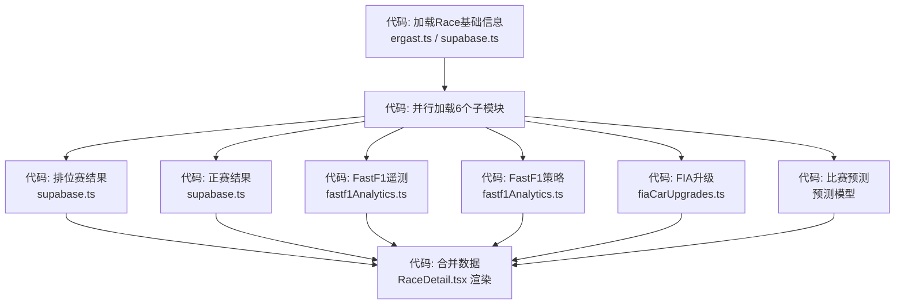
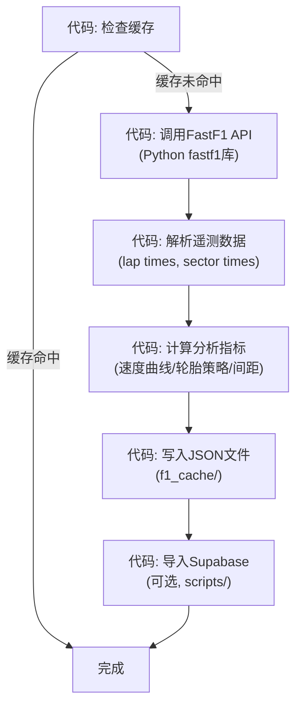
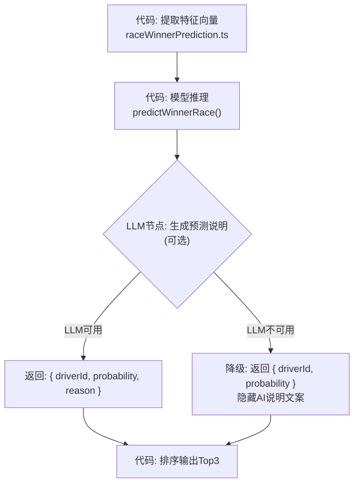

# FormularOneWeb 工程规范 v1.0

本规范融合了 `.claude/` 完整 Skill 体系的方法论精华，面向 FormularOneWeb 项目实际技术栈和代码结构编写。

> **设计理念**：规范不是限制创造力的枷锁，而是让团队（人和AI）在同一个蓝图上协作的轨道。每一项规范都回答"为什么这样做"而不仅是"怎么做"。

---

## 第一章：数据模型与接口契约（对应第6周）

> **总纲**：数据模型决定了你以后能问系统什么问题；接口契约决定了前后端和AI能不能长期和平共处。

### 1.1 北极星：三根支柱

每次设计表结构、修改接口时，对照 DDIA 三根支柱自问：

| 支柱 | 人话 | 在这个项目里它问你什么 |
|------|------|----------------------|
| **可靠** | 出错了还能不能正确服务？ | 脏数据、重复提交、并发写入时，Supabase 的 unique constraint / not null / foreign key 能不能兜住？ |
| **可扩展** | 用户和数据多了还能不能撑住？ | 是不是把所有东西都堆一张表？FastF1 数据会不会把 Supabase 塞爆？ |
| **可维护** | 三周后的你和队友还能不能看懂、敢改？ | `src/types/index.ts` 的 175+ 接口字段含义清楚吗？关系是一眼能画出来还是全靠猜？ |

### 1.2 三种数据，本项目的选择

| 类型 | 项目中的载体 | 适合的数据 | 不适合 |
|------|-------------|-----------|--------|
| **关系型** | Supabase Postgres | Driver, Constructor, Circuit, Race, FiaCarUpgrade 等有清晰外键关系的业务实体 | 把整篇遥测 JSON 当 blob 乱塞 |
| **文档型** | FastF1 静态 JSON（`f1_cache/`, `data/`） | 遥测分析、轮胎策略、天气数据——结构变化快、嵌套深 | 需要强一致和外键关联的查询 |
| **向量型** | 当前不引入 | 暂无语义检索需求 | 如果将来要做"相似比赛条件检索"，可考虑 pgvector |

**关键决策**：FastF1 遥测数据不走 Supabase 实时查询，而是预计算后存为静态 JSON。原因见 ADR-004。

### 1.3 核心数据对象与Schema

该项目 6 张核心数据库表（Supabase Postgres）：

#### drivers
```
字段           | 类型          | 约束          | 说明
driverId       | text          | PK            | 车手唯一标识（如 alonso）
givenName      | text          | NOT NULL      | 名
familyName     | text          | NOT NULL      | 姓
nationality    | text          |               | 国籍
permanentNumber| text          |               | 永久车号
code           | text          |               | 三字母代码（如 ALO）
```
**索引**: `driverId` (PK 自带)
**拆表理由**: 车手是独立实体，与 Constructor 多对多（车手可转会），必须独立建表。

#### constructors
```
字段             | 类型  | 约束     | 说明
constructorId    | text  | PK       | 车队唯一标识（如 ferrari）
name             | text  | NOT NULL | 车队全名
nationality      | text  |          | 车队国籍
```
**拆表理由**: 车队与车手是多对多关系（一个车队多个车手，一个车手可转会），独立建表。

#### circuits
```
字段         | 类型  | 约束     | 说明
circuitId    | text  | PK       | 赛道唯一标识（如 monza）
circuitName  | text  | NOT NULL | 赛道名称
lat / long   | text  |          | 地理位置
locality     | text  |          | 所在城市
country      | text  |          | 所在国家
```
**拆表理由**: 赛道是独立地理实体，不依附于比赛。

#### races
```
字段       | 类型      | 约束     | 说明
season     | text      | NOT NULL | 赛季年份（如 2025）
round      | text      | NOT NULL | 分站轮次
raceName   | text      | NOT NULL | 比赛名
circuitId  | text      | FK->circuits | 关联赛道
date/time  | timestamp |          | 比赛时间
```
**索引**: `(season, round)` 联合唯一索引
**拆表理由**: 比赛信息独立于赛道，同一赛季同一赛道的比赛数据不同。

#### race_results
```
字段         | 类型  | 约束               | 说明
raceId        | uuid  | FK->races          | 比赛ID
driverId      | text  | FK->drivers        | 车手ID
constructorId | text  | FK->constructors   | 车队ID
position      | int   |                    | 完赛名次
points        | float |                    | 获得积分
```
**索引**: `(raceId, driverId)` 联合唯一
**拆表理由**: 比赛结果是"多对多关联表"——一个比赛有多个结果，一个车手有多个比赛结果。

#### fia_car_upgrades
```
字段           | 类型      | 约束    | 说明
id             | uuid      | PK      | 升级记录唯一ID
season         | text      | NOT NULL| 赛季
race_round     | text      | NOT NULL| 比赛轮次
constructor_id | text      | NOT NULL| 车队ID
component      | text      |         | 升级部件类别
reason         | text      |         | 升级原因
description    | text      |         | 升级描述
```
**索引**: `(season, race_round, constructor_id)` 联合索引
**拆表理由**: FIA 升级数据是独立领域对象，有自己的生命周期（PDF解析→结构化→查询）。

**⚠️ 防坑提示**:
- 外键级联删除不随意开——删 driver 时 race_results 怎么办？先想清楚业务规则
- 状态字段用枚举，不用自由文本
- AI 可能把向量字段塞进每张表——想想是否真的需要

### 1.4 接口契约规范

#### 1.4.1 模块分布
```
src/api/          ← API 访问层（Ergast/Jolpica、Supabase、FastF1、FIA）
  ergast.ts         F1 赛事数据 API（Jolpica 代理）
  supabase.ts       Supabase 数据库查询
  fastf1Analytics.ts  FastF1 遥测/分析查询
  fiaCarUpgrades.ts   FIA 赛车升级数据查询
  historyProfiles.ts  车手/车队历史档案
  historySummaries.ts  历史摘要聚合
  raceWeekendAnalytics.ts  比赛周末综合分析
  season.ts          赛季数据
  search.ts          全局搜索

src/hooks/        ← 业务逻辑 Hook（数据获取 + 状态管理）
src/types/index.ts ← 共享类型定义（175+ interfaces）
```

#### 1.4.2 统一错误格式
所有接口返回错误时使用统一结构：
```typescript
interface ApiError {
  code: string;       // 错误码（如 "NOT_FOUND", "TIMEOUT", "UPSTREAM_ERROR"）
  message: string;    // 用户友好的中文描述
  details?: unknown;  // 可选详情（开发调试用，不暴露堆栈）
}
```

#### 1.4.3 异步边界判断
```
操作能在 2 秒内完成  → 同步返回
涉及外部 API / LLM / 文件处理 → 异步（返回 taskId + 状态表）
```
该项目中：
- Ergast/Jolpica API 调用 → 同步（有 8s timeout）
- Supabase 查询 → 同步（5s timeout）
- FastF1 数据导入脚本 → 异步（`scripts/` 中独立运行）
- 预测模型计算 → 同步（3s timeout，纯本地计算）
- FIA PDF 解析 → 异步（`scripts/` 中独立运行）

### 1.5 契约优先四步法

> **金句**：Spec 不是文档，是施工蓝图。AI出初稿，你审定蓝图，再让AI按图施工。

当需要新增或修改 API 接口时，严格按以下四步执行：

**第一步：确认需求**
```
问：「要为哪个功能写契约？（功能名 + 所属模块路径）」
确认数据来源：Ergast / Supabase / FastF1 / FIA
确认异步边界：同步还是返回 taskId
```

**第二步：生成契约初稿**
用以下母提示词让 AI 生成（见附录 B）：
```markdown
我的项目是「FormularOneWeb」，使用 React 18 + TypeScript + Supabase Postgres。
请为「{核心功能}」设计一份接口契约：
1. 路径与HTTP方法
2. 请求体：字段、类型、是否必填、示例值
3. 响应体：成功时的JSON结构
4. 错误返回：统一格式 { code, message, details? }，列出2-3种常见错误
5. 异步边界：该接口是同步返回结果，还是返回taskId由前端轮询？给出建议和理由
请用 Markdown 表格输出，方便我审查和修改。
```

**第三步：人工审改**
- 删掉不需要的字段
- 补业务约束（如唯一性、状态枚举）
- 确认异步边界是否合理
- 检查是否与 `src/types/index.ts` 已有类型定义冲突

**第四步：按契约生成代码**
```markdown
以下是我审定的接口契约（粘贴审改后的版本）。
请严格按契约生成后端路由骨架 + 前端API调用封装，不要增删契约中未定义的字段。
```
- 生成 API 函数 → `src/api/{module}.ts`
- 生成 Hook 封装 → `src/hooks/use{Feature}.ts`
- 更新类型定义 → `src/types/index.ts`

**禁止事项**：
- 不允许绕过契约直接裸写代码
- 不允许在契约外凭空发明字段
- 不允许前后端字段名不一致

### 1.6 API 契约审查清单

每次提交涉及 API 变更时，对照以下检查项（源自 gstack review/api-contract）：

| 检查项 | 说明 |
|--------|------|
| **Breaking Changes** | 是否删除了响应字段？是否改了字段类型？是否新增了必填参数？ |
| **错误一致性** | 新接口的错误格式是否与现有接口一致？HTTP状态码是否匹配错误类型？ |
| **分页** | 列表接口是否有限制返回数量？是否有分页参数？ |
| **文档同步** | 契约文档是否已更新？`src/types/index.ts` 是否同步？ |

---

## 第二章：工作流编排（对应第7周）

> **总纲**：工作流是责任分工图——代码负责「必须按序发生的事」，LLM负责「需要语义理解的节点判断」，人负责「高危动作的最终拍板」。

### 2.1 Workflow vs Agent 决策卡

| 概念 | 谁决定下一步 | 特征 | 本项目适用场景 |
|------|-------------|------|--------------|
| **Workflow** | 代码预定义路径 | 可预测、可测试、可回滚 | 比赛数据加载、数据导入管道 |
| **Agent** | LLM自主决定 | 灵活但难预测 | Trae SOLO 执行工程任务 |

**工业界共识**：能用 Workflow 解决的，绝不用全自主 Agent。

### 2.2 架构风格选型

| 场景 | 风格 | 本项目应用 |
|------|------|-----------|
| 步骤固定、数据单向流动 | **Pipeline** | FastF1 数据导入脚本（`scripts/`） |
| 需要通知/异步回调 | **Event-Driven** | 暂无（未来：WebSocket 推送比赛实时数据） |
| 普通 CRUD | **Layered** | 源码结构（`api/` → `hooks/` → `pages/`） |

### 2.3 核心工作流 1：比赛详情页数据加载

这是项目中最重要的用户可见工作流——RaceDetail 页面同时加载 6 个数据模块。



**控制方式说明**：
- 每一步都是**代码控制**（调用 API 函数），无 LLM 节点
- 6 个子模块**并行加载**（Promise.all），互不阻塞
- 每步独立 fail-fast：某模块加载失败不影响其他模块
- 失败时用户看到：「{模块名} 数据暂时不可用」，而非整个页面白屏
- 已使用 `useCachedData` Hook 做数据缓存，减少重复请求

### 2.4 核心工作流 2：FastF1 数据导入管道

这是项目中最重要的后台数据管道，通过 `scripts/` 中的 Python/TypeScript 脚本执行。



**控制方式说明**：
- 全部由代码控制（Python 脚本 + TypeScript 导入脚本），无 LLM 节点
- 每一步依赖前一步的输出
- npm 脚本入口：`npm run fastf1:export-race` / `npm run fastf1:export-season`
- 失败恢复：从 `f1_cache/` 的 JSON 缓存中恢复，不必从零开始

### 2.5 核心工作流 3：比赛预测计算

该项目有 3 个预测模型（线性逻辑回归 / 非线性神经网络 / RNN 时序嵌入）。



**控制方式说明**：
- 特征提取和模型推理是**纯代码**（`src/utils/raceWinnerPrediction.ts`）
- LLM 节点仅用于**生成人类可读的预测说明**，属于增强功能，可降级
- LLM 输出要求结构化：`{ driverId: string, reason: string, confidence: number }`
- **降级兜底**：LLM 不可用时只显示概率数字，不影响核心预测功能

### 2.6 tasks 状态表设计

为数据导入等长任务提供进度追踪和失败恢复能力。

```sql
CREATE TABLE tasks (
  id UUID PRIMARY KEY DEFAULT gen_random_uuid(),
  task_type VARCHAR(64) NOT NULL,         -- 'fastf1_import' | 'fia_parse'
  status VARCHAR(16) NOT NULL DEFAULT 'pending'
    CHECK (status IN ('pending', 'processing', 'done', 'failed')),
  current_step VARCHAR(64),               -- 当前步骤名
  error_msg TEXT,                          -- 用户友好错误（不暴露堆栈）
  retry_count INT NOT NULL DEFAULT 0,
  input_params JSONB,                      -- 任务输入参数
  output_result JSONB,                     -- 任务结果
  created_at TIMESTAMPTZ NOT NULL DEFAULT now(),
  updated_at TIMESTAMPTZ NOT NULL DEFAULT now()
);
```

**为什么重要**：失败时用户看到「卡在 {current_step} 步骤，正在重试」；开发者打开数据库一眼看出在哪一站、错误是什么。

### 2.7 Human-in-the-loop 三色分级

| 风险等级 | 典型动作 | 策略 | 本项目示例 |
|---------|---------|------|-----------|
| 🟢 **低** | 只读分析、生成草稿、补注释 | 放心让 Agent/SOLO 自动跑 | 补日志、补 README |
| 🟡 **中** | 改业务代码、重构函数、更新配置 | 先看 Diff，小步合并 | 修改 `src/api/*.ts`、提取 Hook |
| 🔴 **高** | 删数据、改生产配置、发通知 | 代码层加审批节点，人工确认 | 修改 Supabase migration、操作生产数据库 |

**代码中的体现**：
```typescript
// 伪代码示意——高危步骤加审批
if (action.riskLevel === 'high') {
  const approval = await requestHumanApproval(action);
  if (!approval.confirmed) {
    return { status: 'cancelled', reason: '人工拒绝' };
  }
}
await executeAction(action);
```

### 2.8 Agent 执行边界

当使用 Trae SOLO 或 Claude Code Agent 执行工程任务时，必须遵守三件事：

1. **写清禁区**：`【禁止】不改数据库 Schema / 不提交密钥 / 不删数据`
2. **审 Diff 再接受**：在对话里点「查看变更」，先看 diff，不要盲目接受
3. **按验收标准检查**：Agent 说「完成了」≠ 你的标准也通过了

**SOLO 任务模板**：
```
【模式】SOLO Coder
【目标】{一句话，如：为 API 路由增加统一错误处理与日志}
【范围】允许修改：{如 src/api/**}
【禁止】不修改：{如 supabase/migrations、.env 密钥、数据库结构、接口契约字段}
【验收标准】{如：本地可启动；触发错误时返回契约定义的 {code, message} 格式}
【停止条件】若测试无法运行，列出缺失依赖与建议命令，不要编造结果
```

### 2.9 设计先行

（源自 superpowers brainstorming 方法论）

在开始任何编码之前，先走设计流程：

1. 探索项目上下文（读文件、查文档、看最近提交）
2. 问澄清问题（一次一个）
3. 提出 2-3 种方案（带权衡和推荐）
4. 分段呈现设计，逐段获得确认
5. 写设计文档 → `docs/superpowers/specs/YYYY-MM-DD-<topic>-design.md`
6. 规格说明书自审（检查占位符、矛盾、歧义、范围）
7. 用户审核规格说明书
8. 转到实施计划

**总纲**：即使是"简单"的改动也要先设计——简单项目才是未审视假设造成最多返工的地方。

---

## 第三章：系统免疫（对应第8周）

> **总纲**：系统质量不是功能数量，而是在出事时你有多快知道、有多快恢复、有多快让下一个人接上来。

### 3.1 结构化日志

#### 3.1.1 三层日志架构

```
请求进入
  └─ API 日志：module / function / status / durationMs
       └─ 工作流日志：step / input / output / status
            └─ 外部调用日志：service / latency / status / error
```

#### 3.1.2 JSON 日志格式

```typescript
// src/utils/logger.ts — 结构化日志工具
interface LogEntry {
  event: 'entry' | 'step' | 'exit';  // 日志事件类型
  module: string;                     // 模块名（如 'ergast', 'supabase'）
  function: string;                   // 函数名
  timestamp: string;                  // ISO 8601
  // entry 时
  input?: string;                     // 输入参数概要（不记录敏感信息）
  // step 时
  step?: string;                      // 步骤名称
  durationMs?: number;                // 该步骤耗时
  // exit 时
  status?: 'success' | 'failed';      // 出口状态
  error?: string;                     // 用户友好错误描述
}
```

#### 3.1.3 日志级别

| 级别 | 用途 | 环境 |
|------|------|------|
| `logger.info()` | 正常流程记录（entry/step/exit） | 开发+生产 |
| `logger.warn()` | 降级/重试场景 | 开发+生产 |
| `logger.error()` | 错误场景（含错误类型） | 开发+生产 |
| `logger.debug()` | 开发调试信息 | 仅 DEV 环境 |

**使用示例**：
```typescript
import { logger } from '@/utils/logger';

async function fetchRaceData(season: string, round: string) {
  logger.info(JSON.stringify({
    event: 'entry', module: 'ergast', function: 'fetchRaceData',
    input: `season=${season}, round=${round}`, timestamp: new Date().toISOString(),
  }));

  const startedAt = performance.now();
  try {
    const result = await ergastApi.get(`/${season}/${round}/results.json`);
    logger.info(JSON.stringify({
      event: 'step', module: 'ergast', function: 'fetchRaceData',
      step: 'api_call', durationMs: Math.round(performance.now() - startedAt),
    }));
    logger.info(JSON.stringify({
      event: 'exit', module: 'ergast', function: 'fetchRaceData',
      status: 'success', durationMs: Math.round(performance.now() - startedAt),
    }));
    return result;
  } catch (error) {
    logger.error(JSON.stringify({
      event: 'exit', module: 'ergast', function: 'fetchRaceData',
      status: 'failed', durationMs: Math.round(performance.now() - startedAt),
      error: '赛事数据获取失败，请稍后重试',
    }));
    throw error;
  }
}
```

**禁止事项**：
- 不允许使用 `console.log` 代替结构化日志（生产环境）
- 不允许在日志中暴露堆栈、密钥或用户敏感信息

### 3.2 韧性四条铁律

> 系统不是会不会出故障的问题，而是出了故障之后其他部分还能不能活。

#### 铁律一：外部调用必须有 Timeout

没有 timeout 的外部调用，等于把你的系统命运交给别人。

| 调用类型 | 超时时间 | 依据 |
|---------|---------|------|
| Ergast/Jolpica API | 8s | 聚合查询可能慢，用户可接受等 8s |
| Supabase 查询 | 5s | 数据库查询应在 5s 内完成 |
| FastF1 静态 JSON | 5s | 静态文件加载 |
| FIA 外部文档 | 5s | 外部资源下载 |
| 预测模型计算 | 3s | 纯本地计算，应快速完成 |

**反例 vs 正例**：
```typescript
// ❌ 没有超时——如果服务卡住，整个页面永远等待
const result = await externalApi.get('/data');

// ✅ 有超时——3s 没回来就放弃，返回友好提示
const result = await withTimeout(
  externalApi.get('/data'),
  { timeoutMs: 3000, fallback: { status: 'error', message: '服务暂时不可用，请稍后重试' } }
);
```

#### 铁律二：重试有上限

重试是好事，但无限重试会让故障放大（重试风暴）。

```typescript
// src/utils/withRetry.ts — 通用重试工具
const RETRY_CONFIG = {
  maxRetries: 3,
  baseDelayMs: 1000,    // 指数退避：1s → 2s → 4s
  maxDelayMs: 8000,
};

// 只对以下错误类型重试：
// ✅ 网络超时（TimeoutError）
// ✅ HTTP 429（限流）
// ✅ HTTP 5xx（服务端错误）

// 不重试：
// ❌ HTTP 4xx 客户端错误（404, 400 等）
// ❌ 业务逻辑错误
```

**指数退避计算**：`delay = min(baseDelayMs * 2^attempt, maxDelayMs)`

#### 铁律三：AI 功能必须有降级兜底

大模型 API 限流或挂了，不代表你整个产品挂了。

| 场景 | 不好（没降级） | 好（有降级） |
|------|--------------|------------|
| 预测模型中 LLM 生成说明超时 | 整个预测卡片空白 | 只显示概率数字，隐藏"AI 分析"模块 |
| FastF1 遥测加载失败 | 页面报错 | 隐藏遥测图表区，显示"遥测数据暂不可用" |
| FIA 升级数据不可用 | 升级模块崩溃 | 隐藏升级模块，不影响比赛详情其他内容 |
| Supabase 超时 | 白屏 | 显示"部分数据加载失败，正在重试…"，其余模块正常显示 |

**金句**：降级不是失败，是设计——你提前想好了「AI不工作时，用户还能干什么」。

#### 铁律四：重任务不阻塞用户主流程

- 大模型调用、文件处理、批量任务 → 默认放后台
- 前端立刻返回「处理中…」
- 任务完成后更新 tasks 状态表（见 2.6）

**本项目应用**：
- FastF1 数据导入 → npm scripts（`npm run fastf1:export-*`），独立进程
- FIA PDF 解析 → npm scripts（`npm run fia:import-*`），独立进程
- 页面数据加载 → 已使用 `useCachedData` 缓存 + 独立 fail-fast

### 3.3 Evals 框架

> 你对 AI 输出的信心，应该来自数字，而不是感觉。跑一遍 Evals，是把「我觉得不错」变成「准确率 87%」。

#### 3.3.1 评测对象

| 模型 | 文件 | 评测指标 | 合格线 / 目标 |
|------|------|---------|-------------|
| 线性逻辑回归预测 | `src/utils/raceWinnerPrediction.ts` | top1Accuracy / top3Accuracy / logLoss / brierScore | > 基线 / > 30% |
| 非线性神经网络预测 | `src/utils/raceWinnerNonlinearPrediction.ts` | top1Accuracy / top3Accuracy / logLoss | > 线性模型 + 5% |
| RNN 时序嵌入 | `src/utils/raceWinnerSequenceModel.ts` | 输出范围 [0,1] / 序列长度稳定性 | 无 NaN / 全在 [0,1] |
| FIA 升级解析 | `src/api/fiaCarUpgrades.ts` | 字段提取准确率 / 置信度分布 | > 70% / 低置信度 < 30% |

#### 3.3.2 评测流程

```typescript
// src/utils/evals/evalsRunner.ts — 通用评测引擎
async function runEvals<TInput, TOutput>(
  modelName: string,
  testCases: Array<{ input: TInput; expected: Partial<TOutput> }>,
  modelFn: (input: TInput) => Promise<TOutput>,
  checks: {
    format: (output: TOutput) => boolean;   // 格式合规检查
    content: (output: TOutput, expected: Partial<TOutput>) => boolean; // 内容准确检查
  }
): Promise<EvalsReport> {
  // 1. 批量运行
  // 2. 统计格式合规率
  // 3. 统计内容准确率
  // 4. 输出报告
}
```

#### 3.3.3 评测阈值

| 指标 | 合格线 | 目标值 |
|------|--------|--------|
| 格式合规率 | >= 95% | 100% |
| 分类/解析准确率 | >= 70% | >= 80% |
| top1Accuracy（预测） | > 随机基线 | > 30%（F1 预测天然低准确率） |

**可复用基础设施**：`src/utils/raceWinnerPrediction.ts:386` 的 `evaluateWinnerPredictions()` 已定义 `WinnerPredictionMetrics`（top1Accuracy/top3Accuracy/logLoss/brierScore）。

### 3.4 ADR 目录

> 代码告诉机器怎么做，ADR 告诉人类为什么这样做。

#### 3.4.1 ADR 五段式模板

```markdown
## ADR-N：[一句话描述]

- **背景**：为什么需要做这个决策？当时面临什么约束或压力？
- **选项**：
  - A：[描述] — 优点：[…] 缺点：[…]
  - B：[描述] — 优点：[…] 缺点：[…]
- **决策**：选择 [A/B]
- **原因**：为什么选这个而不是其他？（这是最重要的一行）
- **代价**：这个选择的限制或缺点是什么？如果用户增长10倍，这里会先挂吗？
```

#### 3.4.2 该项目需要的 ADR

| 编号 | 标题 | 核心决策 |
|------|------|---------|
| ADR-001 | 前端技术栈选型：React 18 + Vite | 为什么选 Vite 而非 Next.js/CRA |
| ADR-002 | 数据源策略：Ergast API + Supabase 缓存 | 为什么需要双层数据源 |
| ADR-003 | 预测模型选型：线性 vs 非线性 vs RNN | 各模型的适用场景和取舍 |
| ADR-004 | FastF1 数据存储：静态 JSON 而非实时查询 | 为什么预计算存 JSON 而不是每次调 API |
| ADR-005 | FIA 升级解析：正则+规则而非 LLM | 为什么选确定性解析而非大模型 |

### 3.5 代码审查全景

每次提交前，对照以下 7 个专项检查（源自 gstack review specialists）：

#### 3.5.1 API 契约（api-contract）
- [ ] 是否删了响应字段？是否改了字段类型？—— Breaking Change？
- [ ] 错误格式是否与现有接口一致？`{ code, message, details? }`
- [ ] 分页接口是否有 LIMIT？
- [ ] `src/types/index.ts` 是否同步更新？

#### 3.5.2 可维护性（maintainability）
- [ ] 有没有死代码（变量赋值未读、函数定义未调）？
- [ ] 有没有魔法数字（裸数字字面量、硬编码URL）？
- [ ] 有没有注释过时（改了代码没改注释）？
- [ ] 有没有重复代码块（3+ 行相似逻辑）？
- [ ] 有没有模块边界违反（页面直接操作 API 不走 hooks）？

#### 3.5.3 性能（performance）
- [ ] 有没有 N+1 查询（循环内调数据库）？
- [ ] 有没有遗漏的数据库索引？
- [ ] 有没有 O(n²) 算法（嵌套循环处理大数据集）？
- [ ] 列表接口有没有分页？
- [ ] 有没有可以并行但串行了的请求？→ 用 Promise.all
- [ ] 有没有不必要的 re-render？

#### 3.5.4 测试（testing）
- [ ] 新代码的负向路径有测试吗？（错误处理、边界值）
- [ ] 测试之间有共享状态吗？（测试隔离性）
- [ ] 有没有时序依赖的测试？（可能导致 flaky）
- [ ] 权限检查有测试吗？

#### 3.5.5 安全（security）
- [ ] 用户输入有校验吗？
- [ ] 有没有在日志中暴露密钥或 PII？
- [ ] 有没有使用 `dangerouslySetInnerHTML`？
- [ ] API 端点有没有认证？

#### 3.5.6 数据迁移（data-migration）
- [ ] 迁移可以回滚吗？
- [ ] 会不会丢数据？（drop column / change type）
- [ ] 加索引用了 CONCURRENTLY 吗？（生产环境）
- [ ] 新 NOT NULL 列有 DEFAULT 值吗？

#### 3.5.7 红队对抗（red-team）
- [ ] 10 倍负载下会怎样？
- [ ] 外部服务返回垃圾数据会怎样？
- [ ] 用户快速双击按钮会怎样？
- [ ] 数据库慢（>5s）会怎样？
- [ ] 有没有悄悄吞掉的异常？

### 3.6 工程纪律

#### 3.6.1 TDD 铁律

（源自 superpowers TDD）

```
NO PRODUCTION CODE WITHOUT A FAILING TEST FIRST
```

**RED-GREEN-REFACTOR 循环**：
1. **RED**：写一个失败测试 → 确认它因正确的原因失败
2. **GREEN**：写最小代码让测试通过
3. **REFACTOR**：清理代码，保持测试绿色

**TDD = 务实**：
- 在提交前发现 Bug（比事后调试快）
- 防止回归（测试即刻捕获破坏）
- 文档化行为（测试展示了如何使用代码）

**本项目实践**：已有 `src/**/*.test.ts` 共 ~18 个测试文件，但应覆盖更多负向路径和边界值。

#### 3.6.2 验证不轻信

（源自 superpowers verification-before-completion）

```
NO COMPLETION CLAIMS WITHOUT FRESH VERIFICATION EVIDENCE
```

在任何声称「完成了」「通过了」之前，必须运行验证命令并读取输出：

| 声称 | 需要 | 不够 |
|------|------|------|
| 测试通过 | `npm test` 输出 0 失败 | 上次运行、应该通过 |
| 构建成功 | `npm run build` exit 0 | Linter通过 |
| Bug 修复 | 测试原始症状：通过 | 代码改了、假设修好了 |

**红线**：使用「应该」「似乎」「可能」等词、信任 Agent 的成功报告而不验证。

#### 3.6.3 系统化调试

（源自 superpowers systematic-debugging）

```
NO FIXES WITHOUT ROOT CAUSE INVESTIGATION FIRST
```

**四步调试法**：
1. **根因调查**：读错误信息、复现、检查最近变更、追溯数据流
2. **模式分析**：找类似工作的代码、对比差异
3. **假设验证**：形成单一假设 → 最小改动测试 → 验证
4. **实施修复**：先写失败测试 → 改根因 → 验证通过

**如果 ≥3 次修复都失败**：停止。质疑架构。不要继续修症状。

### 3.7 前端美学

（源自 frontend-design）

该项目已有 `src/styles/design-tokens.css` 定义了完整的设计系统（Ferrari 红 + Vercel + Linear 风格）。

**设计原则**：
- **Typography**：选择有特色的字体，避免 Arial/Inter 等通用字体
- **Color & Theme**：主导色 + 锐利强调色 > 均匀分布的调色板
- **Motion**：关注高影响力时刻（页面加载的 staggered reveal），而非散落的微交互
- **Spatial Composition**：不对称、重叠、对角线流动、网格打破元素
- **Backgrounds**：创造氛围和深度，而非默认纯色

**审查检查**：
- [ ] 是否复用了 `design-tokens.css` 的 CSS 变量？避免硬编码颜色
- [ ] 加载态、空态、错误态是否有明确 UI？
- [ ] 移动端和桌面端是否都检查过布局？
- [ ] 有没有「AI slop」特征（过度居中、紫色渐变、统一圆角、Inter 字体）？

**参考文件**：
- `docs/chart-guidelines.md` — ECharts 图表指南
- `docs/design-brief-template.md` — 页面设计简报模板

---

## 第四章：技能矩阵

### 4.1 技能全景表

#### 该项目自有 Skill（`.trae/skills/` — 6个，已版本控制）

| Skill | 路径 | 触发场景 |
|-------|------|---------|
| frontend-quality-review | `.trae/skills/frontend-quality-review/` | 改页面/图表/UI 时 |
| browser-qa-check | `.trae/skills/browser-qa-check/` | UI/路由/数据加载完成后 |
| refactor-safety-check | `.trae/skills/refactor-safety-check/` | 重构/拆分大文件/去 any 时 |
| github-security-check | `.trae/skills/github-security-check/` | 推送前 |
| version-manager | `.trae/skills/version-manager/` | 版本号/发版前 |
| f1-scoring-rules | `.trae/skills/f1-scoring-rules/` | 历史积分/冠军计算时 |

#### 方法论源 Skill（`.claude/` — 参考，不在版本控制中）

| Skill | 对应本规范章节 | 核心价值 |
|-------|--------------|---------|
| skill-data-modeling.md | 第一章 | 三支柱检查/Schema输出格式 |
| skill-contract-first.md | 第一章 | 契约优先四步法 |
| skill-workflow.md | 第二章 | Pipeline设计/tasks表/HITL |
| skill-solo-executor.md | 第二章 | Agent执行边界/三必做 |
| skill-reliability.md | 第三章 | 三层日志/韧性铁律/Evals/ADR |
| skill-karpathy-guidelines.md | 第三章/全局 | 行为准则/最小改动 |
| gstack review specialists (7个) | 第三章 §3.5 | 代码审查7专项 |
| superpowers TDD | 第三章 §3.6 | TDD铁律+反思防御 |
| superpowers verification | 第三章 §3.6 | 验证先于声称 |
| superpowers systematic-debugging | 第三章 §3.6 | 四步调试法 |
| superpowers brainstorming | 第二章 §2.9 | 设计先行9步法 |
| frontend-design | 第三章 §3.7 | 前端美学/反AI slop |
| webapp-testing | 第三章 | Playwright测试方法 |
| skill-creator | 第四章 §4.4 | Skill编写方法论 |

### 4.2 触发词 → 技能映射

| 用户说 / 场景 | 应触发 |
|-------------|--------|
| 改页面 / 改图表 / 改UI | frontend-quality-review |
| 定接口 / 写契约 / API设计 | skill-contract-first（方法论）→ 按第一章流程执行 |
| 设计流程 / 工作流 / Pipeline | skill-workflow（方法论）→ 按第二章 §2.3-2.5 模式执行 |
| 加日志 / 超时 / 重试 / 加固 | skill-reliability（方法论）→ 按第三章 §3.1-3.2 执行 |
| 评测 / Evals / 预测质量 | skill-reliability（方法论）→ 按第三章 §3.3 执行 |
| 重构 / 拆分文件 | refactor-safety-check |
| 浏览器测试 / 截图 | browser-qa-check |
| 推送 / push | github-security-check |
| 版本号 / 发版 | version-manager |
| 历史积分 / 冠军计算 | f1-scoring-rules |

### 4.3 多技能组合执行顺序

```
新增 API/修改接口：
  契约流程（第一章）→ 代码审查7专项（第三章 §3.5）→ refactor-safety-check

新增数据管道：
  工作流设计（第二章 §2.3-2.5）→ 韧性加固（第三章 §3.1-3.2）→ 代码审查

修改预测模型：
  Evals评测（第三章 §3.3）→ 修改模型 → 重新评测 → refactor-safety-check

UI/页面改动：
  frontend-quality-review → browser-qa-check

推送前：
  version-manager → github-security-check → git push
```

### 4.4 Skill 编写规范

（源自 superpowers writing-skills + skill-creator）

**Skill 即 TDD**：编写 Skill 本身也应遵守 TDD 循环——先写压力测试场景，观察 baseline 行为，写 Skill 使其通过，再关闭漏洞。

**CSO 优化要点**：
- `name`：字母+连字符，动词优先（如 `contract-first` 而非 `contract-creation`）
- `description`：以"Use when..."开头，只描述触发条件，不总结流程
- 关键词覆盖：错误信息、症状、工具名称

**结构规范**：
```
skill-name/
  SKILL.md          # 必选：YAML frontmatter + Markdown指令
  scripts/          # 可选：可执行代码
  references/       # 可选：参考文档
```

---

## 附录：母提示词速查

以下母提示词可直接复制使用。流程统一：AI出初稿 → 你审改 → 再让AI按审定结果生成或补全代码。

### 附录 A · Schema 设计

```
请为我的项目「FormularOneWeb」（React 18 + TypeScript + Supabase Postgres，
F1 赛事数据平台）设计 Postgres 表结构。

至少 3 张表，包含字段类型、主键、外键、是否可空、必要索引建议。
并解释：每张表对应哪个核心对象？为什么这样拆表而不是合并？

我的数据对象：Driver / Constructor / Circuit / Race / RaceResult / FiaCarUpgrade
```

### 附录 B · 接口契约

```
我的项目是「FormularOneWeb」，使用 React 18 + TypeScript + Supabase Postgres + Jolpica F1 API。
请为「{核心功能，如：获取某场比赛的遥测分析}」设计一份接口契约：

1. 路径与HTTP方法
2. 请求体：字段、类型、是否必填、示例值
3. 响应体：成功时的JSON结构
4. 错误返回：统一格式 { code, message, details? }，列出2-3种常见错误
5. 异步边界：该接口是同步返回结果，还是返回taskId由前端轮询？给出你的建议和理由

请用 Markdown 表格输出，方便我审查和修改。
```

### 附录 B-2 · 按审定契约生成代码

```
以下是我审定的接口契约（粘贴审改后的版本）。
请严格按契约生成：
1. src/api/{module}.ts 的 API 函数
2. src/hooks/use{Feature}.ts 的 Hook 封装
3. src/types/index.ts 的类型更新
不要增删契约中未定义的字段。
```

### 附录 C · 工作流设计

```
我的项目是「FormularOneWeb」，技术栈 React 18 + TypeScript + Supabase + FastF1。
请把下面步骤整理为可审查的工作流说明，输出两部分：
1) Mermaid flowchart TD：节点用中文，标注「代码」「LLM」「Tool Calling」控制类型
2) 文字表格：每步的输入/输出、失败时用户看到什么、是否需要人工确认

另外，请帮我设计一张最小 tasks 状态表（字段：id/status/current_step/error_msg/retry_count/created_at）。

我的步骤草稿：
{粘贴步骤表}
```

### 附录 D · 日志 + 超时 + 降级

```
为以下函数/接口补充三层结构化日志（JSON格式）：
1. 进入时记录：调用来源、输入参数概要（不记录敏感信息）、时间戳
2. 每个关键步骤完成时记录：步骤名称、该步骤耗时（ms）
3. 出口时记录：总耗时、status(success/failed)、失败原因

要求：不修改业务逻辑和接口契约字段；日志统一用 logger.info/error()

同时为外部调用加超时保护和降级处理：
- timeout 设置为 {N} 秒（根据业务判断）
- 超时或失败时返回降级响应
- 最多重试 3 次，间隔指数退避（1s, 2s, 4s）

[粘贴你的函数代码]
```

### 附录 E · Evals 脚本

```
为以下 LLM 功能编写最小评测脚本：
功能描述：{如：F1比赛冠军预测——输入赛季+轮次，输出 { driverId, probability }}

测试要求：
- 准备 10-15 条真实历史数据作为测试输入
- 批量调用该功能
- 检查两项：(1) 格式合规 (2) 内容准确
- 输出统计：格式合规率 ___% 、内容准确率 ___%

技术栈：TypeScript / Vitest

[粘贴你的模型函数代码]
```

### 附录 F · ADR 模板

```
## ADR-N：[一句话描述你的决策]

- **背景**：[为什么需要做这个决策？当时面临什么约束？]
- **选项**：
  - A：[描述] — 优点：[…] 缺点：[…]
  - B：[描述] — 优点：[…] 缺点：[…]
- **决策**：选择 [A/B]
- **原因**：[这是最重要的一行——为什么选这个而不是其他？]
- **代价**：[限制或缺点？如果用户增长10倍，这里会先挂吗？]
```

### 附录 G · 代码审查检查表

```
请对以下 diff 进行代码审查，逐项检查并输出发现的问题：

1. API契约：有没有Breaking Change？错误格式一致吗？
2. 可维护性：有没有死代码/魔法数字/过时注释/重复逻辑？
3. 性能：有没有N+1查询/缺索引/O(n²)/可并行的串行请求？
4. 测试：负向路径有测试吗？有flaky风险吗？
5. 安全：用户输入有校验吗？有密钥泄露吗？
6. 数据迁移（如有）：可回滚吗？会丢数据吗？
7. 红队：外部服务挂了会怎样？用户快速双击会怎样？

请用 JSON 格式输出每条 finding。
```

### 附录 H · TDD 循环

```
我的需求是：{描述功能}

请按 TDD 流程执行：
1. RED：先写一个针对此需求的失败测试
2. 等待我确认测试正确
3. GREEN：写最小代码让测试通过
4. REFACTOR：清理代码但保持测试绿色
5. 报告每一步结果
```

### 附录 I · 前端美学审查

```
请审查以下页面的前端设计质量：
1. 是否避免了AI slop特征（过度居中、紫色渐变、通用字体）？
2. 字体选择是否有特色？
3. 颜色是否使用了 design-tokens.css 变量而非硬编码？
4. 动效是否有意图而非随意添加？
5. 空间布局是否避免了默认居中/对称模式？
6. 加载态/空态/错误态是否有适当的UI？

审查页面：{页面路径}
```
